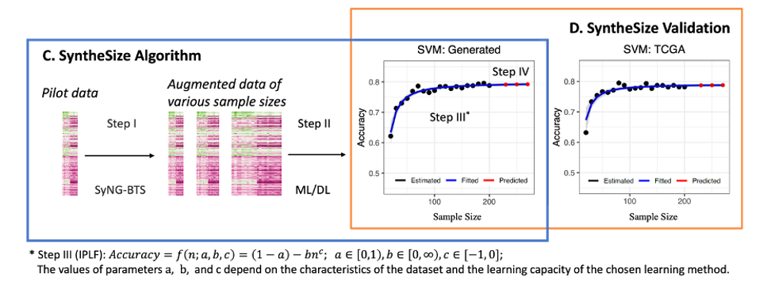

# SyntheSize

## What is it

SyntheSize is a supervised learning framework designed for determining the optimal sample size by utilizing synthesized data across various sample sizes. This framework employs the inverse power law function (IPLF) to accurately fit augmented data corresponding to different sample sizes and their respective prediction accuracies. SyntheSize also illustrates the generated results through heatmap and UMAP(Uniform Manifold Approximation and Projection). The workflow of SyntheSize is depicted in the following figure:

<p align="center">
  
</p>

## News 
* Jan, 2024: SyntheSize version 1.0.0 is launched.

## System Requirements
### Hardware requirements
`SyntheSize` requires only a standard computer with enough RAM to support the in-memory operations. 

### Software requirements
#### OS Requirements
The developmental version of the package has been tested on the following systems:
+ Windows
+ MacOS
 
  
#### R Dependencies
`SyntheSize` is developed under R version 4.1.1.
`SyntheSize` depends on the following R packages:

    ggplot2 3.4.3
    tidyverse 2.0.0 
    DANA 1.1.1
    cowplot 1.1.1 
    ggpubr 0.6.0
    ggsci 3.0.0
    reshape2 1.4.4
    glmnet 4.1-7
    e1071 1.7-13 
    caret 6.0-94
    randomForest 4.7-1.1
    xgboost 1.7.6.1
    ROCR 1.0-11
    class 7.3-22

## Evaluations of generated data in R
```R
# read in data
generated <- read.csv("ExampleData/RNABRCASubtypeSel258_epochES_CVAE1-150_generated.csv", header = F)
real <- read.csv("ExampleData/RNABRCASubtypeSel258.csv", header = T)

# define the default group level
level0 <- real$groups[1]
level1 <- setdiff(unique(real$groups), level0)

# get sample groups
real <- real[order(real$groups),]
groups_real <- real$groups
#The first group label shown in the input data of SyNGBTS is coded as 0, the other group label is coded as 1.
#here we have Ductal as the first group label.
groups_generated <- ifelse(generated[, ncol(generated)] == 0, level0, level1)

# get pure data matrices
real <- select_if(real, is.numeric)
real <- log2(real + 1)
generated <- generated[,1:ncol(real)]
colnames(generated) <- colnames(real)

# heatmap quality evaluation (we only keep 200 samples for each group to save runing time)
real_ind <- c(1:200, (nrow(real)-200):nrow(real))
generated_ind <- c(1:200, (nrow(generated)-200):nrow(generated))
h_subtypes <- heatmap_eval(dat_real = real[real_ind,],
                           dat_generated = generated[generated_ind,])

# UMAP quality evaluation
p_umap_subtypes <- UMAP_eval(dat_real = real[real_ind,],
                             dat_generated = generated[generated_ind,],
                             groups_real = groups_real[real_ind],
                             groups_generated = groups_generated[generated_ind],
                             legend_pos = "bottom")
print(h_subtypes)
print(p_umap_subtypes)
```

## Train classifiers and fit learning curve in R
```R
set.seed(333)
n_candidate <- c(seq(100, 400, 25))
n_target <- seq(410, 430, 10)
metric_generated <- eval_classifier(whole_generated = generated,
                                    whole_groups = groups_generated,
                                    n_candidate = n_candidate,
                                    n_draw = 2, log = TRUE)
metric_real <- eval_classifier(whole_generated = real, 
                               whole_groups = groups_real, 
                               n_candidate = n_candidate,
                               n_draw = 2, log = TRUE)
p_acc <- vis_classifier(metric_generated = metric_generated, 
                        metric_real = metric_real,
                        n_target = n_target)
print(p_acc)
```

## Examples & Tutorials
Using the 500 generated samples on RNABRCASubtype dataset by CVAE with loss ratio 1-5, we demonstrate how to execute 'Synthesize'. 1. Evaluate the generated data using UMAP and heatmap. 2. Train the classiers including xgboost and randomforest and fit a learning curve. 3. Get the desired sample size according to the prediction accuracy on the fitted curve. <br>

If you also would like to use 'SyntheSize' in R, continue here:
+ [SyntheSize Tutorial in R](https://github.com/LXQin/SyntheSize/blob/main/SyntheSize/SyntheSizeExample.Rmd)


<!--## How to Cite SyntheSize (unfinished)
Please cite the following manuscript:
>Supervised learning of high-confidence phenotypic subpopulations from single-cell data. Nature Machine Intelligence (2023). https://doi.org/10.1038/s42256-023-00656-y. <br>
Tao Ren, Canping Chen, Alexey V. Danilov, Susan Liu, Xiangnan Guan, Shunyi Du, Xiwei Wu, Mara H. Sherman, Paul T. Spellman, Lisa M. Coussens, Andrew C. Adey, Gordon B. Mills, Ling-Yun Wu and Zheng Xia -->


## License
SyntheSize is licensed under the GNU General Public License v3.0. <br>
SyntheSize will be updated frequently with new features and improvements. If you have any questions, please submit them on the [GitHub issues page](https://github.com/LXQin/SyntheSize/issues).

## Reference
Cortes, C., Jackel, L. D., Solla, S., Vapnik, V., & Denker, J. (1993). Learning curves: Asymptotic values and rate of convergence. Advances in neural information processing systems, 6. 

